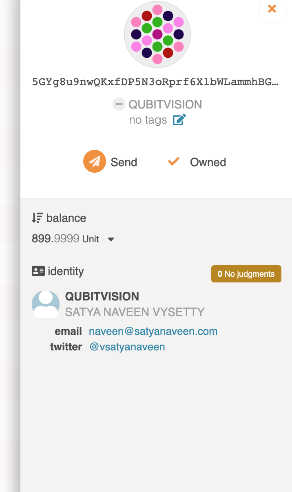

# Set-An-Identity-On-Polkadot-s-Development-Version

## Screenshot 1 
Run polkadot node in development mode

## Screenshot 2
Point localhost under development option

## Screenshot 3
Access the Identity pallet from the account section and fill the relevent fields

## Screenshot 4
Submit the transcation

## Screenshot 5
Now you will see identity got updated to the respective account

## Screenshot 6
Detail view. 

